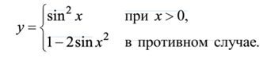
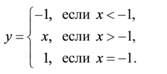
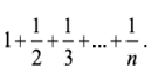
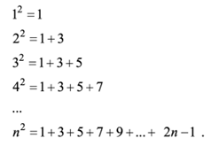
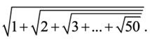

<center>МИНИСТЕРСТВО НАУКИ И ВЫСШЕГО ОБРАЗОВАНИЯ РОССИЙСКОЙ ФЕДЕРАЦИИ ФЕДЕРАЛЬНОЕ ГОСУДАРСТВЕННОЕ БЮДЖЕТНОЕ ОБРАЗОВАТЕЛЬНОЕ УЧРЕЖДЕНИЕ ВЫСШЕГО ОБРАЗОВАНИЯ «САХАЛИНСКИЙ ГОСУДАРСТВЕННЫЙ УНИВЕРСИТЕТ»

Институт естественных наук и техносферной безопасности
Кафедра информатики

Григораш Алексей Владимирович

Лабораторная работа №4. «Основы языка JavaScript».

01.03.02 Прикладная математика и информатика</center>

<p style="text-align: right">Научный руководитель
Соболев Евгений Игоревич </p>

<center>Южно-Сахалинск
2022 г. </center>

## Введение

С помощью JavaScript Вы сможете создавать интерактивные веб-страницы.
Интерактивные страницы могут взаимодействовать с пользователем (выводить сообщения, изменять содержимое после определенных действий и т.д.)
JavaScript встраивается прямо в веб-страницы и исполняется браузером во время их загрузки.
JavaScript был создан в 1995 году как инструмент, предоставляющий веб-дизайнерам возможности программирования. JavaScript обладает простым синтаксисом и его очень легко изучить.
Все современные браузеры имеют поддержку JavaScript.

## Задачи:

1.	Рассчитать значение у при заданном значении х


 
2.	Дано натуральное число n (n<=9999). Выяснить, является ли оно палиндромом
("перевертышем") с учетом четырех цифр, как, например, числа 7777, 8338, 0330 и т. п. (Палиндромом называется число, десятичная запись которого читается одинаково слева направо и справа налево.)

3.	Год является високосным, если его номер кратен 4, однако из кратных 100 високосными являются лишь кратные 400, например, 1700, 1800 и 1900 — невисокосные года, 2000 — високосный. Дано натуральное число n. Определить, является ли високосным год с таким номером.
4.	Составить программу для вычисления значения функции y(x): 


5.	Составить программу, которая в зависимости от порядкового номера дня месяца (1, 2, ..., 12) выводит на экран время года, к которому относится этот месяц.
6.	Мастям игральных карт условно присвоены следующие порядковые номера: масти "пики" — 1, масти "трефы" — 2, масти "бубны" — 3, масти "червы" — 4, а достоинству карт: "валету" — 11, "даме" — 12, "королю" — 13, "тузу" — 14 (порядковые номера карт остальных достоинств соответствуют их названиям: "шестерка", "девятка" и т. п.). По заданным номеру масти m (1 m 4) и номеру достоинства карты k (6 k 14) определить полное название (масть и достоинство) соответствующей карты в виде "Дама пик", "Шестерка бубен" и т. п.

7.	В некоторых странах Дальнего Востока (Китае, Японии и др.) использовался (и неофициально используется в настоящее время) календарь, отличающийся от применяемого нами. Этот календарь представляет собой 60-летнюю циклическую систему. Каждый 60-летний цикл состоит из пяти 12-летних подциклов. В каждом подцикле года носят названия животных: Крыса, Корова, Тигр, Заяц, Дракон, Змея, Лошадь, Овца, Обезьяна, Петух, Собака и Свинья. Кроме того, в названии года фигурируют цвета животных, которые связаны с пятью элементами природы — Деревом (зеленый), Огнем (красный), Землей (желтый), Металлом (белый) и Водой (черный). В результате каждое животное (и его год) имеет символический цвет, причем цвет этот часто совершенно не совпадает с его "естественной" окраской — Тигр может быть черным, Свинья — красной, а Лошадь — зеленой. Например, 1984 год — год начала очередного цикла — назывался годом Зеленой Крысы. Каждый цвет в цикле (начиная с зеленого) "действует" два года, поэтому через каждые 60 лет имя года (животное и его цвет) повторяется. Составить программу, которая по заданному номеру года нашей эры n печатает его название по описанному календарю в виде: "Крыса, Зеленый". Рассмотреть два случая: а) значение n 1984; б) значение n может быть любым натуральным числом.

8.	Напечатать таблицу умножения на 9.

9.	Напечатать "столбиком" значения sin 2 , sin 3 , ..., sin 20 .

10.	Найти: а) сумму всех целых чисел от 100 до 500; б) сумму всех целых чисел от a до 500 (значение a вводится с клавиатуры; a<=500); в) сумму всех целых чисел от –10 до b (значение b вводится с клавиатуры; b=>–10); г) сумму всех целых чисел от a до b (значения a и b вводятся с клавиатуры; b=>a).

11.	Вычислить сумму



12.	Даны натуральные числа х и у. Вычислить произведение x и y, используя лишь операцию сложения. Задачу решить двумя способами.

13.	Составить программу возведения натурального числа в квадрат, учитывая следующую закономерность
 



14.	Вычислить сумму



15.	Дана непустая последовательность целых чисел, оканчивающаяся нулем. Найти: а) сумму всех чисел последовательности; б) количество всех чисел последовательности.

16.	Дана непустая последовательность неотрицательных целых чисел, оканчивающаяся отрицательным числом. Найти среднее арифметическое всех чисел последовательности (без учета отрицательного числа).

17.	Дано натуральное число. Определить: а) количество цифр 3 в нем; б) сколько раз в нем встречается последняя цифра; в) количество четных цифр в нем. Составное условие и более одного неполного условного оператора не использовать; г) сумму его цифр, больших пяти; д) произведение его цифр, больших семи; е) сколько раз в нем встречаются цифры 0 и 5 (всего).


18.	Дано натуральное число, в котором все цифры различны. Определить: а) порядковый номер его максимальной цифры, считая номера: от конца числа; от начала числа; б) порядковый номер его минимальной цифры, считая номера: от конца числа; от начала числа.

19.	Дано натуральное число. Выяснить, является ли оно простым (простым называется натуральное число, большее 1, не имеющее других делителей, кроме единицы и самого себя). Оператор цикла с параметром не использовать.

20.	Дано натуральное число. Установить, является ли последовательность его цифр при просмотре их слева направо упорядоченной по возрастанию. Например, для числа 1478 ответ положительный, для чисел 1782 и 1668 — отрицательный и т. п.

21.	Дана непустая и упорядоченная по возрастанию последовательность целых чисел, оканчивающаяся числом 10 000. Определить порядковый номер первого числа, большего заданного n. Если таких чисел в последовательности нет, то на экран должно быть выведено соответствующее сообщение.

22.	Дано натуральное число. Верно ли, что цифра a встречается в нем реже, чем цифра b?
23.	Имеется фрагмент программы в виде оператора цикла с параметром, обеспечивающий вывод на экран "столбиком" всех целых чисел от 10 до 30. Оформить этот фрагмент в виде: а) оператора цикла с предусловием; б) оператора цикла с постусловием.


24. 7 kyu https://www.codewars.com/kata/head-tail-init-and-last   
25. 6 kyu https://www.codewars.com/kata/array-deep-count
26. 6 kyu https://www.codewars.com/kata/length-of-missing-array
27. 6 kyu https://www.codewars.com/kata/pair-of-gloves
28. 6 kyu https://www.codewars.com/kata/sorting-by-bits
29. 6 kyu https://www.codewars.com/kata/lets-recycle

## Решение:
Файл app.js:
```JavaScript
const methods = require('./lab4.js');

console.log(`1.     ` +  methods.Method1(5));
console.log(`2.     ` +  methods.IsPolindrom(123321));
console.log(`3.     ` +  methods.CheckTheYear(1984));
console.log(`4.     ` +  methods.Method4(5));
console.log(`5.     ` +  methods.Season(10));
console.log(`6.     ` +  methods.Cards(3, 13));
console.log(`7.     ` +  methods.AsianCalendar(1984));
console.log(`8.     ` +  methods.multTab(9));
console.log(`9.     ` +  methods.SinCol(20));
console.log(`10 a.     ` +  methods.Method10.A(5));
console.log(`10 b.     ` +  methods.Method10.B(30));
console.log(`10 c.     ` +  methods.Method10.C(50));
console.log(`10 d.     ` +  methods.Method10.D(4, 120));
console.log(`11.     ` +  methods.Method11(5));
console.log(`12.     ` +  methods.Method12(6, 5));
console.log(`13.     ` +  methods.Method13(5));
console.log(`14.     ` +  methods.Method14(50));
console.log(`15.     ` +  methods.Method15());
console.log(`16.     ` +  methods.Method16());
console.log(`17.     ` +  methods.Method17());
console.log(`18.     ` +  methods.Method18());
console.log(`19.     ` +  methods.Method19(21));
console.log(`20.     ` +  methods.Method20(1478));
console.log(`21.     ` +  methods.Method21(4000));
console.log(`22.     ` +  methods.Method22());
console.log(`23.     ` +  methods.Method23());
```
Файл lab4.js:
```JavaScript
module.exports = {

    Method1 : let  = (x) => x > 0 ? Math.sin(x) ** 2 : 1 - 2*Math.sin(x**2),

    IsPolindrom : let  = (n) => String(n) == String(n).split('').reverse().join('')? true : false,
    
    CheckTheYear : let = (year) => (year % 4 == 0 && year % 100 != 0 || year % 400 == 0)? true : false,
    
    Method4 : let  = (x) => x < -1 ? -1 : x > -1 ? x : 1,

    Season : function(m){
        let dics = {
            1:'Зима',
            2:'Зима',
            12:'Зима',
            3:'Весна',
            4:'Весна',
            5:'Весна',
            6:'Лето',
            7:'Лето',
            8:'Лето',
            9:'Осень',
            10:'Осень',
            11:'Осень'
        };
        return  m > 12 || m < 1? 'такого месяца нет': dics[m]; 
    },

    Cards : function (m, k){
        let dics = {
            1:'пики',
            2:'трефы',
            3:'бубны',
            4:'червы',

            6:'шестёрка',
            7:'семёрка',
            8:'восьмёрка',
            9:'девятка',
            10:'десятка',
            11:'валет',
            12:'дама',
            13:'король',
            14:'туз'
        };

        return 1 > m | m > 4 ? '1 =< m =< 4!!' : 6 > k | k > 14 ? '6 =< m =< 14!!' : `${dics[k]} ${dics[m]}`;
    },

    AsianCalendar : function (n){
        let animals = ["Крыса", "Корова", "Тигр", "Заяц", "Дракон", "Змея", "Лошадь", "Овца", "Обезьяна", "Петух", "Собака", "Свинья"] ;
        let colors = ["зеленый", "зеленый", "красный", "красный", "желтый", "желтый", "белый", "белый", "черный", "черный" ];
        return `${animals[(n - 4) % animals.length]}, ${colors[(n - 4) % colors.length]}`;
    },

    multTab : function (n){
        let result = '\n';
        for (let i = 1; i < 11; i++)  result += `${n} * ${i} = ${n * i}\n`;
        return result;
    },

    SinCol : function (x){
        let result = '\n';
        for (let i = 2; i < x + 1; i++) result += `Sin(${i}) = ${Math.sin(i).toFixed(5)}\n`
        return result;
    },

    Method10 : let = {
        A : function(){
            let result = 0;
            for (let i = 100; i < 501; i++) result += i;
            return result;
        }, 
        B : function(n){
            if (n > 500) return "a <= 500!";
            else {
                let result = 0;
                for (let i = n; i < 501; i++) result += i;
                return result;
            }
        },
        C : function(n){
            if (n < -10) return "b => –10!";
            else {
                let result = 0;
                for (let i = -10; i <= n; i++) result += i;
                return result;
            }
        },
        D : function(a , b){
            if (a > b) return "b >= a!";
            else {
                let result = 0;
                for (let i = a; i <= b; i++) result += i;
                return result;
            }
        }
    },

    Method11 : function(n){
        if (n < 1) return "n >= 1"
        else {
            let result = 0;
            for (let i = 1.0; i <= n; i++) result += 1 / i;
            return result;
        }
    },

    Method12 : function(x, y){
        if (x < y) [x, y] = [y, x];
        if (x < 0 && y < 0) [x, y] = [-x, -y];
        result = 0;
        for (let i = 0; i < x; i++) result += y;
        return result;
    },

    Method13 : function(x){
        if (x < 0) x = -x;
        let result = 0;
        for (let i = 1; i <= x; i++) result += 2*i - 1;
        return result;
    },

    Method14 : function(x){
        let result = Math.sqrt(x);
        for (let i = x - 1; i >= 1 ; i--) result = Math.sqrt(i + result);
        return result;
    },

    Method15 : function(){
        let chars = '1234567890';
        let sum = 0;
        let array = [];
        for (let i = 0; i < Math.floor(Math.random() * 10) + 7; i++){
            array.push(chars.charAt(Math.floor(Math.random() * chars.length)));
            sum += Number(array[i]);
        }
        array.push(0);
        return `последовательность: ${array}\nа) суммa всех чисел: ${sum}\nб) количество всех чисел: ${array.length}`;
    },

    Method16 : function(){
        let chars = '1234567890';
        let sum = 0;
        let array = [];
        for (let i = 0; i < Math.floor(Math.random() * 10) + 7; i++){
            array.push(chars.charAt(Math.floor(Math.random() * chars.length)));
            sum += Number(array[i]);
        }
        array.push(-Math.floor(Math.random() * 10) - 1);
        return `последовательность: ${array}\nарифметическое всех чисел последовательности (без учета отрицательного числа): ${(sum / (array.length - 1)).toFixed(2)}`;
    },

    Method17 : function(){
        let x = Math.floor(Math.random() * 10000000000000000) + 1;
        let n = String(x);
        let resultA = 0;
        let resultB = 0;
        let resultC = 0;
        let resultD = 0;
        let resultE = 1;
        let resultF = 0;
        for (let i = 0; i < n.length; i++){
            if (n[i] == '3') resultA++ ; 
            if (n[i] == '0'|| n[i] == '5') resultF++ ; 
            if (parseInt(n[i]) % 2 == 0) resultC++ ; 
            if (n[i] == n[n.length - 1]) resultB++ ; 
            if (parseInt(n[i]) > 5) resultD += parseInt(n[i]); 
            if (parseInt(n[i]) > 7) resultE *= parseInt(n[i]); 
        }
        return `Число: ${x}\nа) количество цифр 3 в нем: ${resultA}\nб) сколько раз в нем встречается последняя цифра: ${resultB}\nв) количество четных цифр в нем: ${resultC}\nг) сумму его цифр, больших пяти: ${resultD}\nд) произведение его цифр, больших семи: ${resultE}\nе) сколько раз в нем встречаются цифры 0 и 5: ${resultF}`;
    },

    Method18 : function(){
        let array = [];
        let number = '';
        for (let i = 0; i < Math.floor(Math.random() * 1) + 10; i++){
            array.push(Math.floor(Math.random() * 10));
        }
        array.forEach(e => number += e);

        let maxL = 0
        let minL = 9;
        let maxR = 0;
        let minR = 9;
        let maxLi, minLi, maxRi, minRi;

        for (let i = 0; i < array.length; i++){
            if (array[i] > maxL){
                maxL = array[i];
                maxLi = i + 1;
            }
            if (array[i] < minL){
                minL = array[i];
                minLi = i + 1;
            }
        }

        array.reverse()
        for (let i = 0; i < array.length; i++){
            if (array[i] > maxR){
                maxR = array[i];
                maxRi = i + 1;
            }
            if (array[i] < minR){
                minR = array[i];
                minRi = i + 1;
            }
        }
        
        return `Число: ${number}, длинна: ${number.length}\nа) порядковый номер его максимальной цифры, считая номера: от конца числа: ${maxRi} ; от начала числа: ${maxLi}\nб) порядковый номер его минимальной цифры, считая номера: от конца числа: ${minRi}; от начала числа: ${minLi}. `;
    },

    Method19 : function(x){
        let n = 2;
        while(x > n){
            if (x % n == 0) return false;
            n++;
        }
        return true;
    },

    Method20 : function(x){
        let n = String(x);
        for (let i = 0; i < n.length - 1; i++)
            if (n[i] >= n[i + 1]) return false;
        return true;
    },

    Method21 : function(n){
        let result = "Нет такого числа";
        let array = [];
        array.push(10000);
        for (let i = 0; i < 10; i++)
            array.push(Math.floor(Math.random() * 10000));
        array.sort((x, y) => x - y);

        for (let i = 0; i < array.length; i++){
            if (array[i] > n) {
                result = `порядковый номер первого числа, большего заданного n: ${i + 1}`; 
                break;
            }
        }
        return `Число n: ${n}\nПоследовательность целых чисел: ${array}\n${result}`;
    },

    Method22 : function(){
        let number = '';
        let a = Math.floor(Math.random() * 10);
        let b = Math.floor(Math.random() * 10);
        while (a == b) b = Math.floor(Math.random() * 10);
        let aCount = 0;
        let bCount = 0;
        let array = [];
        for (let i = 0; i < 15; i++){
            array.push(Math.floor(Math.random() * 10));
            if(array[i] == a) aCount++;
            else if (array[i] == b) bCount++;
        }
        array.forEach(e => number += e);

        let result = aCount < bCount ? true : false;

        return `a: ${a}, b: ${b}\nЧисло: ${number}\nРзультат: ${result}    ${aCount}   ${bCount}`;
    },

    Method23 : function(){
        let i1 = 10;
        let i2 = 10;
        let result1 = '';
        let result2 = '';

        while (i1 <= 30) {
            result1 += `${i1}\n`;
            i1++;
        }
        
        do  {
            result2 += `${i2}\n`;
            i2++;
        }while (i2 <= 30)

        return `Оформить этот фрагмент в виде:\nа) оператора цикла с предусловием\n${result1}б) оператора цикла с постусловием\n${result2}`;
    }
}

```


[Задания 24 - 29](https://www.codewars.com/users/thejiexa/completed_solutions)

## Вывод:
В ходе выполнения задач повторил работу c переменными, операторами, способами вывода, циклами, функциями.
